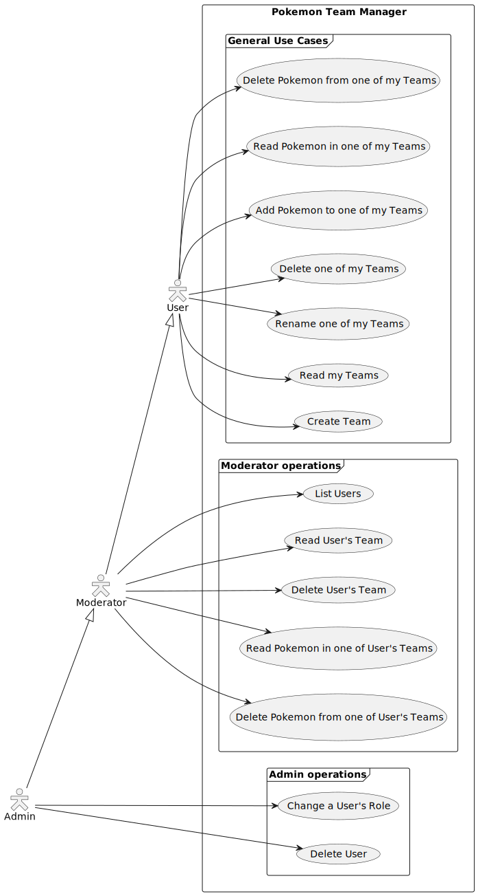
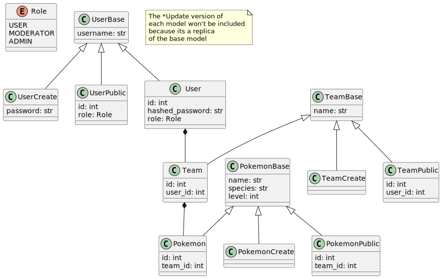

# Pokemon Team Builder

Aplicacion web para crear y gestionar equipos Pokemon. Proyecto personal de formacion centrado en el desarrollo de APIs REST con FastAPI.

**Demo:** https://pokemon-team-maker-ffbi.onrender.com/

## Funcionalidad

- **Registro e inicio de sesion** con autenticacion JWT y hashing de contrasenas con Argon2
- **Crear, renombrar y eliminar equipos** (cada usuario gestiona los suyos)
- **Anadir y quitar Pokemon** de un equipo (maximo 6 por equipo, niveles del 1 al 100)
- **Sprites automaticos** obtenidos de PokeAPI en el frontend
- **Panel de moderacion** con listado de usuarios, busqueda por ID o nombre, y gestion de equipos de cualquier usuario
- **Panel de administracion** para gestionar roles de usuario y eliminar cuentas
- **Control de acceso por roles** (usuario, moderador, administrador)
- **Documentacion interactiva** de la API en `/docs` (Swagger UI)
 
## Stack

| Capa          | Tecnologia                                                      |
| ------------- | --------------------------------------------------------------- |
| Backend       | FastAPI + Uvicorn                                               |
| Base de datos | SQLite (local) / PostgreSQL en Neon (produccion), via SQLModel  |
| Auth          | JWT (PyJWT) + Argon2                                            |
| Frontend      | HTML + vanilla JS + Bootstrap 5 (generado con IA)               |
| Deploy        | Docker + Docker Hub + GitHub Actions + Render                   |

## API

La API es consumible de forma independiente al frontend. Todos los endpoints (salvo auth) requieren un token JWT en la cabecera `Authorization: Bearer <token>`.

| Metodo   | Ruta                                               | Rol       | Descripcion                          |
| -------- | -------------------------------------------------- | --------- | ------------------------------------ |
| `POST`   | `/auth/register`                                   | publico   | Crear cuenta                         |
| `POST`   | `/auth/login`                                      | publico   | Obtener token JWT                    |
| `GET`    | `/teams/`                                          | usuario   | Listar equipos del usuario           |
| `POST`   | `/teams/`                                          | usuario   | Crear equipo                         |
| `GET`    | `/teams/{id}`                                      | usuario   | Detalle de un equipo con sus Pokemon |
| `PATCH`  | `/teams/{id}`                                      | usuario   | Renombrar equipo                     |
| `DELETE` | `/teams/{id}`                                      | usuario   | Eliminar equipo                      |
| `POST`   | `/teams/{id}/pokemon`                              | usuario   | Anadir Pokemon al equipo             |
| `DELETE` | `/teams/{id}/pokemon/{pokemon_id}`                 | usuario   | Quitar Pokemon del equipo            |
| `GET`    | `/users/`                                          | moderador | Listar todos los usuarios            |
| `GET`    | `/users/{id}/teams`                                | moderador | Listar equipos de un usuario         |
| `GET`    | `/users/{id}/teams/{team_id}`                      | moderador | Detalle de equipo de un usuario      |
| `DELETE` | `/users/{id}/teams/{team_id}`                      | moderador | Eliminar equipo de un usuario        |
| `DELETE` | `/users/{id}/teams/{team_id}/pokemon/{pokemon_id}` | moderador | Quitar Pokemon de equipo ajeno       |
| `PATCH`  | `/users/{id}/role`                                 | admin     | Cambiar rol de un usuario            |
| `DELETE` | `/users/{id}`                                      | admin     | Eliminar usuario y todos sus datos   |

## Diagramas

### Casos de uso



### Modelo de dominio



## Ejecutar en local

```bash
# Clonar y entrar
git clone https://github.com/mablospate/Pokemon_Team_Maker.git
cd Pokemon_Team_Maker

# Crear .env
echo "SECRET_KEY=$(python -c 'import secrets; print(secrets.token_hex(32))')" > .env
echo "DATABASE_URL=sqlite:///pokemon.db" >> .env
# Opcional: seed de usuario admin
echo "ADMIN_USERNAME=admin" >> .env
echo "ADMIN_PASSWORD=tu_password" >> .env

# Instalar dependencias y arrancar
uv sync
uv run uvicorn app.app:app --reload
```

O con Docker:

```bash
docker build -t pokemon-team-builder .
docker run -p 8000:8000 pokemon-team-builder
```

La app estara disponible en `http://localhost:8000`.

## Nota sobre contenido generado con IA

Tanto el frontend (`front.html`) como este README han sido generados con IA. El objetivo de este proyecto es la formacion en desarrollo de APIs REST con Python y FastAPI, no el desarrollo frontend ni la documentacion. El frontend existe unicamente como interfaz visual para consumir y demostrar la API, pero todo el trabajo manual y el foco de aprendizaje esta en el backend: diseño de endpoints, modelos de datos, autenticacion, y despliegue.

## Sobre el proyecto

Este es un proyecto de formacion para aprender a construir APIs REST. La implementacion actual es deliberadamente simple: no tiene validacion exhaustiva de errores y los modelos son basicos. En local usa SQLite; en produccion (Render) se conecta a una base de datos PostgreSQL en Neon, ya que los contenedores de Render son efimeros y un fichero SQLite se perderia en cada redespliegue.

El plan es expandir la funcionalidad integrando la PokeAPI para que los equipos incluyan datos reales de cada Pokemon (stats, tipos, movimientos, habilidades) y se puedan exportar en formato importable a Pokemon Showdown.
